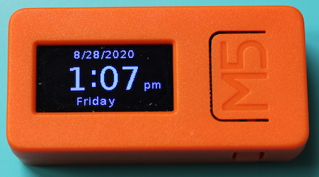
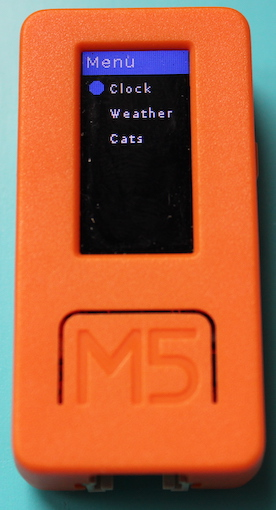
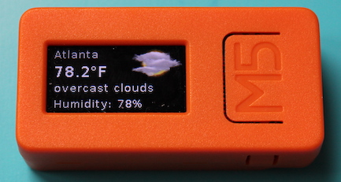
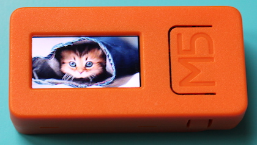
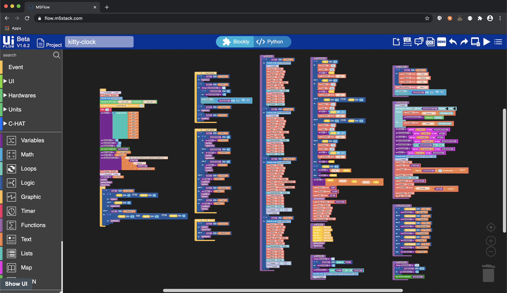

# kitty-clock
A fun little M5StickC clock, including weather data from the OpenWeather API and pictures of cute kitty cats

-----------------------------------------------------------------
### Objective
The objective of this project was to implement a basic NTP clock using the M5StickC and the M5Stack uiFlow Blockly IDE. In addition, I decided to make it fun by adding two additional features to display the weather and pictures of cats. My goal was to use as many native, non-customized blocks as I could. But in reality, there are limitations and bugs with the uiFlow IDE, in which I had to use a few **execute** blocks to workaround those issues.

-----------------------------------------------------------------

### Current Functionality
+ Menu to select between clock, weather, and picture modes.
+ RTC (Real Time Clock) synchronized via NTP for time accuracy
+ Weather data from your specific location via the OpenWeather API
+ 10 pictures of cute kitty cats
+ Adjustable screen brightness while on the clock and weather modes

-----------------------------------------------------------------

### Installation
1. Copy all the .jpg images from the images folder to the M5StickC using the Adafruit ampy CLI tool (preferred), Thonny IDE, or Mu IDE and put them in the /flash/res directory. You can also try to use the uiFlow Resource Manager, but I sometimes found it unreliable during the upload and refresh process.
2. Using your browser (Chrome is preferred), go to the web uiFlow IDE at https://flow.m5stack.com
3. Open kitty-clock.m5f using the menu in the upper right of the IDE
4. Ensure uiFlow has the correct API key for your M5StickC device. If not, set the correct API key in the Settings menu of uiFlow.
5. Update the Wi-Fi SSID and password in the setup routine of the program
6. Adjust the NTP host and timezone offset to your specific location. The default is US Eastern time (UTC -4) since that is my time zone.
7. Update the api_appid variable block with your OpenWeather API app ID (https://home.openweathermap.org/api_keys). Sign-up and create a new API key (or use the default key) if necessary.
8. *Optional:* If you want the temperature displayed in Celsius instead of Fahrenheit (default), change the last block of the openweather_api variable block to be `&units=metric` instead of `&units=imperial`.
8. Update api_city variable block with the city of your location. The default location is Atlanta, GA.
9. Run the program (using the Play button) or Download the program (using the Download option in the IDE menu) to your M5StickC device

-----------------------------------------------------------------

## Navigation Instructions
*NOTE:* There are 3 buttons on the M5StickC. Power/Reset on the left side, Button A (labeled M5) on the front, and Button B on the right side.

After the program loads, the user is presented with the clock.

### Clock mode
  
+ Press Button A to adjust the screen brightness
+ Press Button A and Button B simultaneously to force sync the RTC with updated time and date from the NTP sever. This is optional and only necessary if the time gets out of sync.
+ Press Button B to display the Menu

### Menu
  1. Clock
  2. Weather
  3. Cats
  

+ Press Button A to move the selection dot down the list. It will wrap back to the top after the last menu item.
+ Press Button B to select that menu item.

### Weather
  
+ Press Button A to adjust the screen brightness
+ Press Button B to display the Menu

### Cats
  
+ Press Button A to cycle through the 10 pictures of cute kitty cats.
+ Press Button B to display the Menu

-----------------------------------------------------------------

## uiFlow
  

-----------------------------------------------------------------

## Additional Notes
I'm sure there are some undiscovered bugs that I'm not aware of. If you notice anything, please provide feedback in the form of a comment or pull request if you fix it.
